# Flutter Sharez 🚀

<div align="center">
  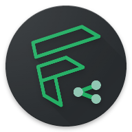
</div>

Flutter Sharez is a modern file-sharing app built using the Flutter framework and powered by Riverpod. This app allows users to effortlessly share and receive files across different platforms. With an intuitive and user-friendly interface, Flutter Sharez redefines the way you share files.

## Features 🌟
- **Cross-Platform:** Flutter Sharez is developed using Flutter, ensuring seamless performance and consistent user experience across multiple platforms including iOS, Android, Linux, MacOS,Windows .

- **File Sharing:** Share files of various formats, such as images, documents, videos, and more, with just a few taps. Receive files from others as well.

- **User-Friendly Interface:** The app features a clean and intuitive interface that makes sharing and receiving files a breeze, even for first-time users.

- **Theme Options:** Flutter Sharez offers a customizable theme experience. Choose between light, dark, or let the app automatically switch based on system preferences.

- **Riverpod Powered:** Flutter Sharez utilizes the Riverpod state management library, enabling efficient and scalable state management throughout the app.


## Screenshots 📸

### Sender Screen

<p float="left" style="display: flex; justify-content: space-between margin-right: 16px margin-left: 16px;">
  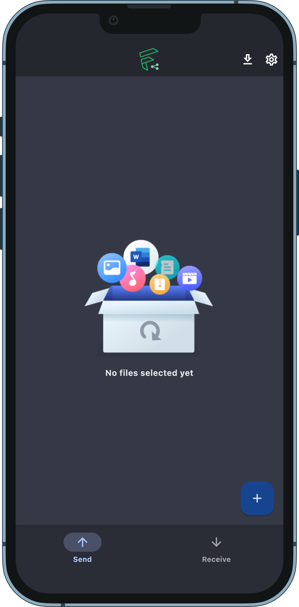   
     
  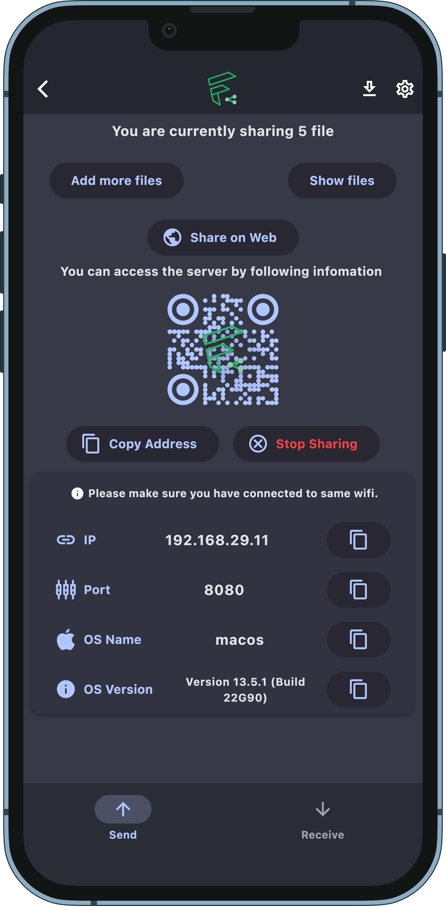   
  
  
  
</p>
<p float="left" style="display: flex; justify-content: space-between margin-right: 16px margin-left: 16px;">

  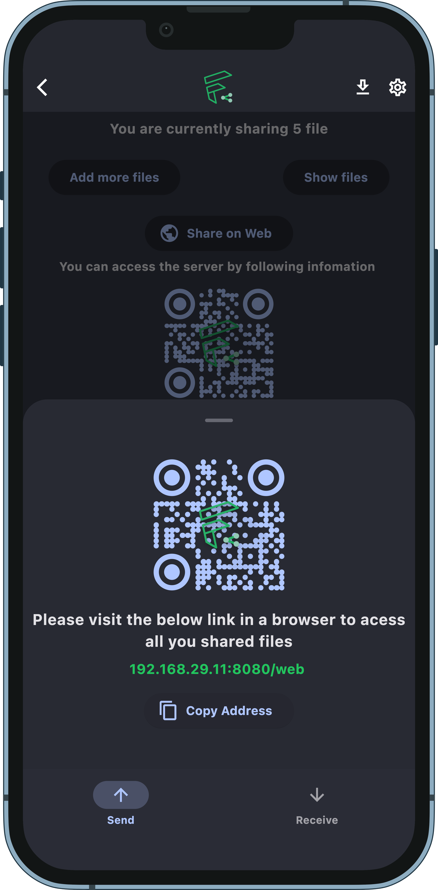   
  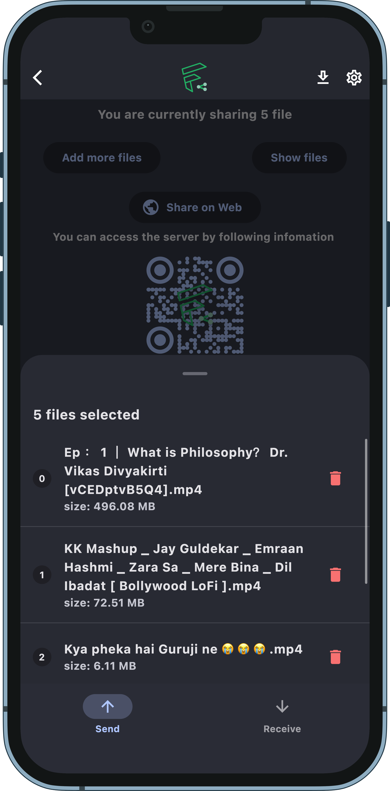   
  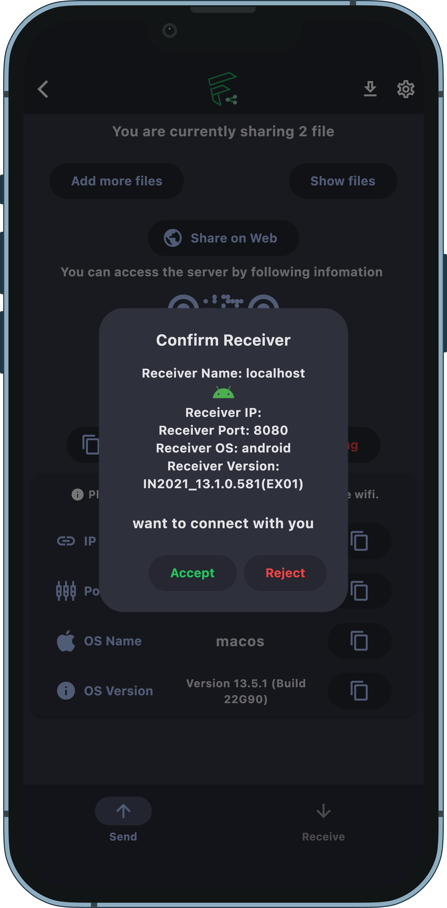   
  
  
</p>


### Receiver Screen
<br>
<p float="left" style="display: flex; justify-content: space-between margin-right: 16px; ">
  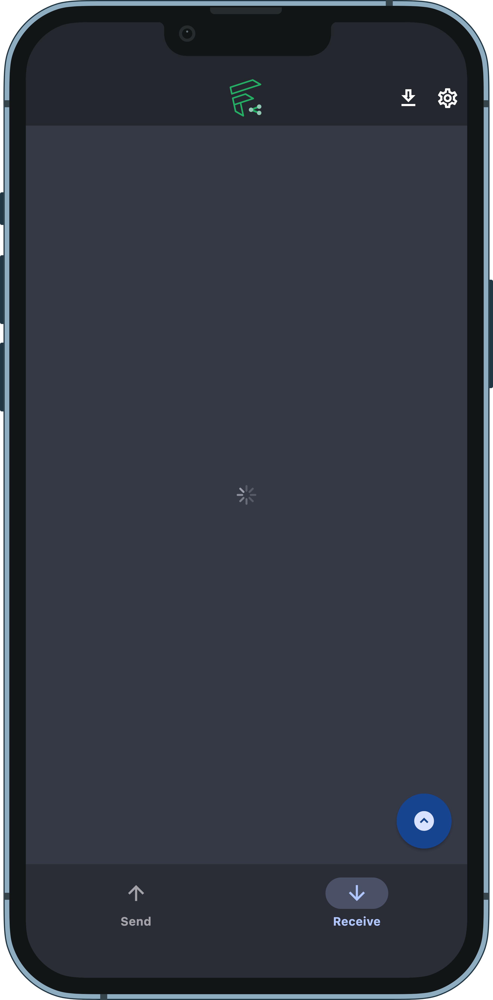  
  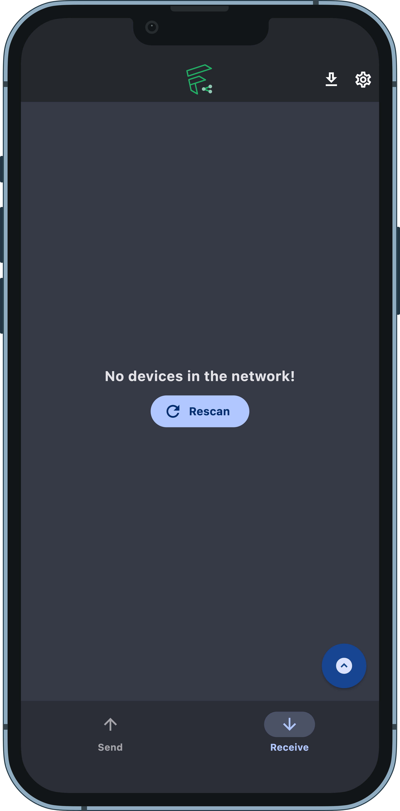   
  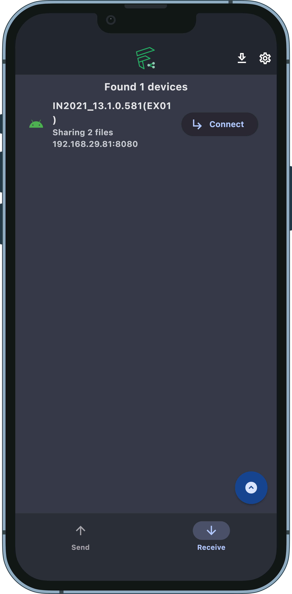    
  
</p>
<br>
<p float="left" style="display: flex; justify-content: space-between margin-right: 16px; ">
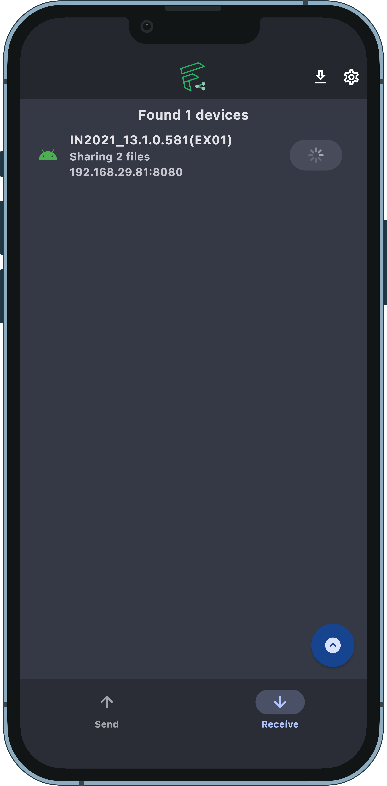   
  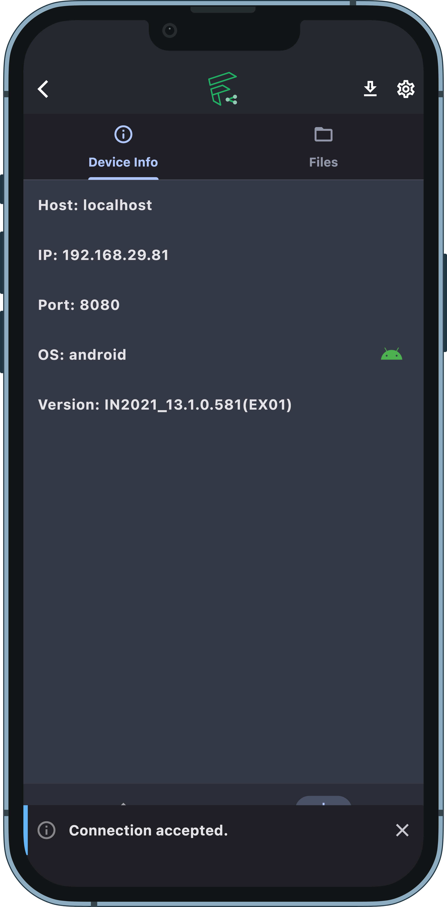  
  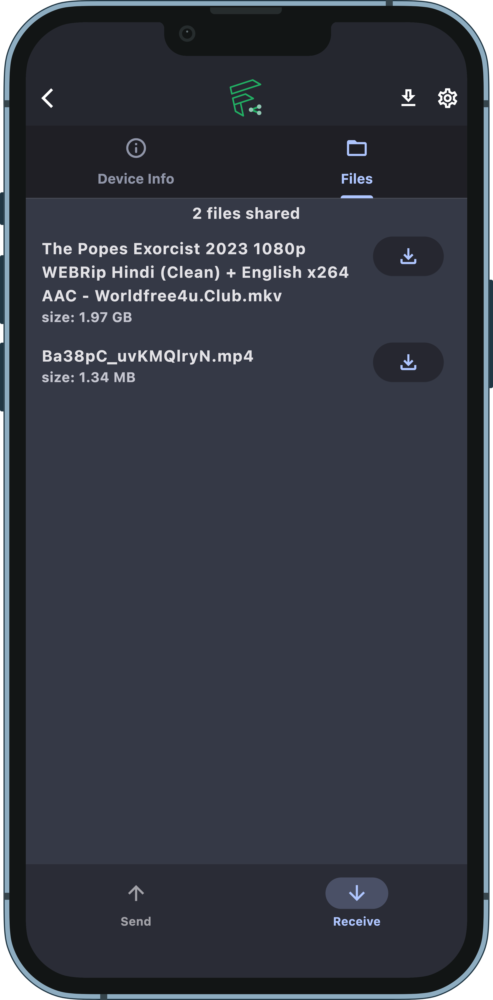   
  
  
</p>
<br>
<p float="left" style="display: flex; justify-content: space-between margin-right: 16px; ">
   
    

</p>


## Installation 🛠️

To get started with Flutter Sharez, follow these steps:

1. Clone the repository:

   ```bash
   git clone https://github.com/Shreemanarjun/flutter_sharez.git
   ```

2. Navigate to the project directory:

   ```bash
   cd flutter_sharez
   ```

3. Install dependencies:

   ```bash
   flutter pub get
   ```

4. Run the app:

   ```bash
   flutter run
   ```

For more detailed instructions, troubleshooting, and additional setup options, 

## Packages Used 📦


- **ai_barcode_scanner:** A barcode scanning package that uses AI to recognize barcodes in images or camera streams.

- **alfred:** A Dart package for server-side management, simplifying tasks such as handling requests, routing, and resource management.

- **auto_route:** A powerful routing package that generates named routes and simplifies navigation in your Flutter app.

- **dart_jwt_token:** A package for working with JSON Web Tokens (JWT) for secure authentication and authorization.

- **dio:** A versatile HTTP client for making network requests, handling responses, and working with interceptors.

- **dio_smart_retry:** An extension for Dio that provides smart retry mechanisms for failed HTTP requests.

- **file_picker:** A package for picking files from various sources, including the device's storage and cloud services.

- **flutter_riverpod:** A state management library based on Provider, enabling reactive and efficient app state management.

- **hive_flutter:** A lightweight and fast NoSQL database for Flutter, providing local storage capabilities.

- **lottie:** A Flutter package for displaying Lottie animations, adding dynamic and interactive animations to your app.

- **qr_flutter:** A package for generating QR codes as widgets in your Flutter app.

For a complete list of dependencies, including minor packages, please refer to the `pubspec.yaml` file.


## To-Do Features 📝

Here are some features that we plan to implement in future releases of Flutter Sharez:

- **Resumable Downloads:** Introduce the ability to resume interrupted or paused downloads, ensuring a seamless download experience even in case of network disruptions.

- **Already Downloaded File List:** Display a list of files that have already been downloaded, making it easy for users to track their downloaded content.

- **Manual Connections:** Allow users to manually establish connections with other devices for file sharing, providing greater control over the sharing process.

These are just a few of the exciting features we have in mind. Stay tuned for updates as we continue to enhance Flutter Sharez!


## Contributing 🤝

Contributions are welcome! If you encounter any issues or have ideas for enhancements, feel free to create issues or pull requests in this repository.

### Getting Started

- Fork the repository.
- Clone the forked repository to your local machine.
- Create a new branch for your changes.
- Make your modifications or additions.
- Commit your changes with descriptive messages.
- Push your changes to your forked repository.
- Create a pull request to the original repository's `main` branch.

### Guidelines

- Follow the project's coding style and conventions.
- Provide detailed descriptions in your pull requests and issues.
- Be respectful and considerate in discussions.

Your contributions help improve and grow the project!

 ## License 🍀
 This project is licensed under the [MIT License](LICENSE).


 MIT License

Copyright (c) 2023 Shreeman Arjun Sahu

Permission is hereby granted, free of charge, to any person obtaining a copy
of this software and associated documentation files (the "Software"), to deal
in the Software without restriction, including without limitation the rights
to use, copy, modify, merge, publish, distribute, sublicense, and/or sell
copies of the Software, and to permit persons to whom the Software is
furnished to do so, subject to the following conditions:

The above copyright notice and this permission notice shall be included in all
copies or substantial portions of the Software.

THE SOFTWARE IS PROVIDED "AS IS", WITHOUT WARRANTY OF ANY KIND, EXPRESS OR
IMPLIED, INCLUDING BUT NOT LIMITED TO THE WARRANTIES OF MERCHANTABILITY,
FITNESS FOR A PARTICULAR PURPOSE AND NONINFRINGEMENT. IN NO EVENT SHALL THE
AUTHORS OR COPYRIGHT HOLDERS BE LIABLE FOR ANY CLAIM, DAMAGES OR OTHER
LIABILITY, WHETHER IN AN ACTION OF CONTRACT, TORT OR OTHERWISE, ARISING FROM,
OUT OF OR IN CONNECTION WITH THE SOFTWARE OR THE USE OR OTHER DEALINGS IN THE
SOFTWARE.

---


